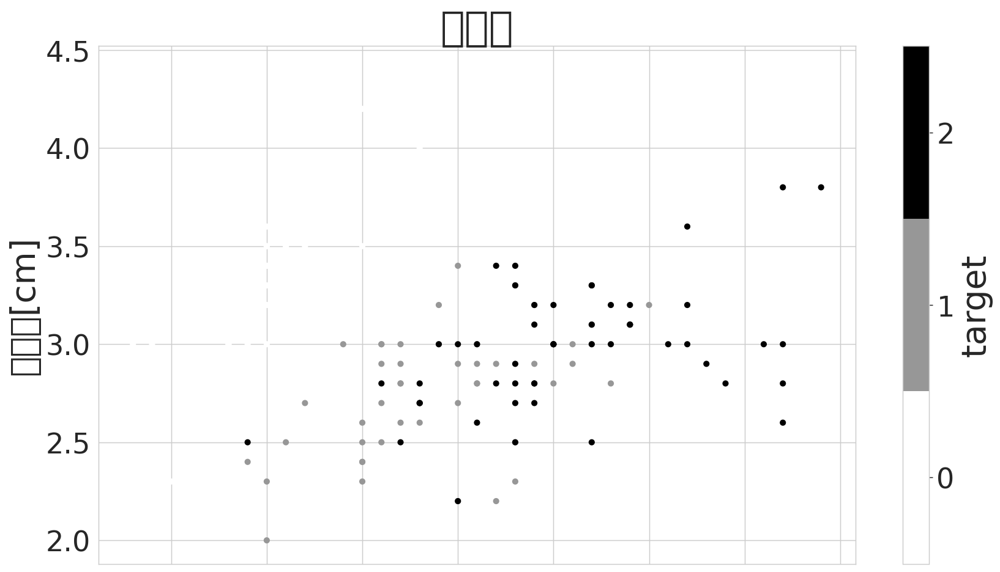

# lileda
> lilacs EDA library, ie,  lil-eda


EDA(Exploratory Data Analysis, 探索的データ分析)を簡単にするための自分用ライブラリ。

本ライブラリの開発には[nbdev](https://github.com/fastai/nbdev)を使用しています。

# インストール方法

## 編集可能インストール（推奨）

カレントディレクトリに`lileda`フォルダができる。そのフォルダ内のファイルを編集することで、本ライブラリを編集できる

```
git clone https://github.com/lilacs2039/lileda.git
# git submodule add https://github.com/lilacs2039/lileda.git lileda
cd lileda
pip install -e .
```

## 通常インストール
```
pip install git+https://github.com/lilacs2039/lileda
```


# 使い方

## 前提：分析データ・ライブラリの読み込み

分析でよく使うライブラリと本ライブラリを読み込み

```
%matplotlib inline
%reload_ext autoreload
%autoreload 2
import pandas as pd
import matplotlib.pyplot as plt
import seaborn as sns
```

今回の分析データ（iris）を読込んで先頭行を確認。

```
from sklearn.datasets import load_iris
iris = load_iris()
df = pd.DataFrame(iris.data, columns=iris.feature_names).merge(
    pd.DataFrame(iris.target).rename(columns={0:"target"})
    , left_index=True, right_index=True
)
df.target = df.target.astype("category")
df.head()
```


<div>
<style scoped>
    .dataframe tbody tr th:only-of-type {
        vertical-align: middle;
    }

    .dataframe tbody tr th {
        vertical-align: top;
    }

    .dataframe thead th {
        text-align: right;
    }
</style>
<table border="1" class="dataframe">
  <thead>
    <tr style="text-align: right;">
      <th></th>
      <th>sepal length (cm)</th>
      <th>sepal width (cm)</th>
      <th>petal length (cm)</th>
      <th>petal width (cm)</th>
      <th>target</th>
    </tr>
  </thead>
  <tbody>
    <tr>
      <th>0</th>
      <td>5.1</td>
      <td>3.5</td>
      <td>1.4</td>
      <td>0.2</td>
      <td>0</td>
    </tr>
    <tr>
      <th>1</th>
      <td>4.9</td>
      <td>3.0</td>
      <td>1.4</td>
      <td>0.2</td>
      <td>0</td>
    </tr>
    <tr>
      <th>2</th>
      <td>4.7</td>
      <td>3.2</td>
      <td>1.3</td>
      <td>0.2</td>
      <td>0</td>
    </tr>
    <tr>
      <th>3</th>
      <td>4.6</td>
      <td>3.1</td>
      <td>1.5</td>
      <td>0.2</td>
      <td>0</td>
    </tr>
    <tr>
      <th>4</th>
      <td>5.0</td>
      <td>3.6</td>
      <td>1.4</td>
      <td>0.2</td>
      <td>0</td>
    </tr>
  </tbody>
</table>
</div>


## liledaの読み込み

```
import lileda.eda as lle
```

## グラフの自動保存先を設定

`setup`でグラフの自動保存先を設定できる。デフォルト：./output

```
lle.setup(sub_dir = "usage")
```

    lileda> Output directory : '/mnt/e/Users/Chilly/Documents/OneDrive/Codes/output/usage'


## データ概要

`describe`でDataFrameの要約（統計量や欠損値の数など）を表示。

```
lle.describe(df)
```

    データ形式


<div>
<style scoped>
    .dataframe tbody tr th:only-of-type {
        vertical-align: middle;
    }

    .dataframe tbody tr th {
        vertical-align: top;
    }

    .dataframe thead th {
        text-align: right;
    }
</style>
<table border="1" class="dataframe">
  <thead>
    <tr style="text-align: right;">
      <th></th>
      <th>sepal length (cm)</th>
      <th>sepal width (cm)</th>
      <th>petal length (cm)</th>
      <th>petal width (cm)</th>
      <th>target</th>
    </tr>
  </thead>
  <tbody>
    <tr>
      <th>0</th>
      <td>5.1</td>
      <td>3.5</td>
      <td>1.4</td>
      <td>0.2</td>
      <td>0</td>
    </tr>
    <tr>
      <th>0</th>
      <td>float64</td>
      <td>float64</td>
      <td>float64</td>
      <td>float64</td>
      <td>category</td>
    </tr>
  </tbody>
</table>
</div>


    要約統計量（数値）


<div>
<style scoped>
    .dataframe tbody tr th:only-of-type {
        vertical-align: middle;
    }

    .dataframe tbody tr th {
        vertical-align: top;
    }

    .dataframe thead th {
        text-align: right;
    }
</style>
<table border="1" class="dataframe">
  <thead>
    <tr style="text-align: right;">
      <th></th>
      <th>sepal length (cm)</th>
      <th>sepal width (cm)</th>
      <th>petal length (cm)</th>
      <th>petal width (cm)</th>
    </tr>
  </thead>
  <tbody>
    <tr>
      <th>count</th>
      <td>150.000</td>
      <td>150.000</td>
      <td>150.000</td>
      <td>150.000</td>
    </tr>
    <tr>
      <th>mean</th>
      <td>5.843</td>
      <td>3.057</td>
      <td>3.758</td>
      <td>1.199</td>
    </tr>
    <tr>
      <th>std</th>
      <td>0.828</td>
      <td>0.436</td>
      <td>1.765</td>
      <td>0.762</td>
    </tr>
    <tr>
      <th>min</th>
      <td>4.300</td>
      <td>2.000</td>
      <td>1.000</td>
      <td>0.100</td>
    </tr>
    <tr>
      <th>25%</th>
      <td>5.100</td>
      <td>2.800</td>
      <td>1.600</td>
      <td>0.300</td>
    </tr>
    <tr>
      <th>50%</th>
      <td>5.800</td>
      <td>3.000</td>
      <td>4.350</td>
      <td>1.300</td>
    </tr>
    <tr>
      <th>75%</th>
      <td>6.400</td>
      <td>3.300</td>
      <td>5.100</td>
      <td>1.800</td>
    </tr>
    <tr>
      <th>max</th>
      <td>7.900</td>
      <td>4.400</td>
      <td>6.900</td>
      <td>2.500</td>
    </tr>
    <tr>
      <th>欠損数</th>
      <td>0.000</td>
      <td>0.000</td>
      <td>0.000</td>
      <td>0.000</td>
    </tr>
    <tr>
      <th>欠損率</th>
      <td>0.000</td>
      <td>0.000</td>
      <td>0.000</td>
      <td>0.000</td>
    </tr>
  </tbody>
</table>
</div>


    要約統計量（数値以外）


<div>
<style scoped>
    .dataframe tbody tr th:only-of-type {
        vertical-align: middle;
    }

    .dataframe tbody tr th {
        vertical-align: top;
    }

    .dataframe thead th {
        text-align: right;
    }
</style>
<table border="1" class="dataframe">
  <thead>
    <tr style="text-align: right;">
      <th></th>
      <th>target</th>
    </tr>
  </thead>
  <tbody>
    <tr>
      <th>count</th>
      <td>150.0</td>
    </tr>
    <tr>
      <th>unique</th>
      <td>3.0</td>
    </tr>
    <tr>
      <th>top</th>
      <td>0.0</td>
    </tr>
    <tr>
      <th>freq</th>
      <td>50.0</td>
    </tr>
    <tr>
      <th>欠損数</th>
      <td>0.0</td>
    </tr>
    <tr>
      <th>欠損率</th>
      <td>0.0</td>
    </tr>
  </tbody>
</table>
</div>


## plotを整形して保存

### pandasのプロットを整形して保存

```
lle.plot(df.plot.scatter("sepal length (cm)","sepal width (cm)",c="target")
        ,tl="散布図", xl="がく長さ[cm]", yl="がく幅[cm]")
```

    /mnt/e/Users/Chilly/Documents/OneDrive/Codes/Jupyter/lileda/lileda/eda.py:155: UserWarning: Glyph 12364 (\N{HIRAGANA LETTER GA}) missing from current font.
      elif tl is not None : fig.savefig(savepath(tl))
    /mnt/e/Users/Chilly/Documents/OneDrive/Codes/Jupyter/lileda/lileda/eda.py:155: UserWarning: Glyph 12367 (\N{HIRAGANA LETTER KU}) missing from current font.
      elif tl is not None : fig.savefig(savepath(tl))
    /mnt/e/Users/Chilly/Documents/OneDrive/Codes/Jupyter/lileda/lileda/eda.py:155: UserWarning: Glyph 24133 (\N{CJK UNIFIED IDEOGRAPH-5E45}) missing from current font.
      elif tl is not None : fig.savefig(savepath(tl))
    /mnt/e/Users/Chilly/Documents/OneDrive/Codes/Jupyter/lileda/lileda/eda.py:155: UserWarning: Glyph 25955 (\N{CJK UNIFIED IDEOGRAPH-6563}) missing from current font.
      elif tl is not None : fig.savefig(savepath(tl))
    /mnt/e/Users/Chilly/Documents/OneDrive/Codes/Jupyter/lileda/lileda/eda.py:155: UserWarning: Glyph 24067 (\N{CJK UNIFIED IDEOGRAPH-5E03}) missing from current font.
      elif tl is not None : fig.savefig(savepath(tl))
    /mnt/e/Users/Chilly/Documents/OneDrive/Codes/Jupyter/lileda/lileda/eda.py:155: UserWarning: Glyph 22259 (\N{CJK UNIFIED IDEOGRAPH-56F3}) missing from current font.
      elif tl is not None : fig.savefig(savepath(tl))
    /home/lilacs/.local/lib/python3.9/site-packages/IPython/core/events.py:89: UserWarning: Glyph 12364 (\N{HIRAGANA LETTER GA}) missing from current font.
      func(*args, **kwargs)
    /home/lilacs/.local/lib/python3.9/site-packages/IPython/core/events.py:89: UserWarning: Glyph 12367 (\N{HIRAGANA LETTER KU}) missing from current font.
      func(*args, **kwargs)
    /home/lilacs/.local/lib/python3.9/site-packages/IPython/core/events.py:89: UserWarning: Glyph 24133 (\N{CJK UNIFIED IDEOGRAPH-5E45}) missing from current font.
      func(*args, **kwargs)
    /home/lilacs/.local/lib/python3.9/site-packages/IPython/core/events.py:89: UserWarning: Glyph 25955 (\N{CJK UNIFIED IDEOGRAPH-6563}) missing from current font.
      func(*args, **kwargs)
    /home/lilacs/.local/lib/python3.9/site-packages/IPython/core/events.py:89: UserWarning: Glyph 24067 (\N{CJK UNIFIED IDEOGRAPH-5E03}) missing from current font.
      func(*args, **kwargs)
    /home/lilacs/.local/lib/python3.9/site-packages/IPython/core/events.py:89: UserWarning: Glyph 22259 (\N{CJK UNIFIED IDEOGRAPH-56F3}) missing from current font.
      func(*args, **kwargs)
    /home/lilacs/.local/lib/python3.9/site-packages/IPython/core/pylabtools.py:151: UserWarning: Glyph 12364 (\N{HIRAGANA LETTER GA}) missing from current font.
      fig.canvas.print_figure(bytes_io, **kw)
    /home/lilacs/.local/lib/python3.9/site-packages/IPython/core/pylabtools.py:151: UserWarning: Glyph 12367 (\N{HIRAGANA LETTER KU}) missing from current font.
      fig.canvas.print_figure(bytes_io, **kw)
    /home/lilacs/.local/lib/python3.9/site-packages/IPython/core/pylabtools.py:151: UserWarning: Glyph 24133 (\N{CJK UNIFIED IDEOGRAPH-5E45}) missing from current font.
      fig.canvas.print_figure(bytes_io, **kw)
    /home/lilacs/.local/lib/python3.9/site-packages/IPython/core/pylabtools.py:151: UserWarning: Glyph 25955 (\N{CJK UNIFIED IDEOGRAPH-6563}) missing from current font.
      fig.canvas.print_figure(bytes_io, **kw)
    /home/lilacs/.local/lib/python3.9/site-packages/IPython/core/pylabtools.py:151: UserWarning: Glyph 24067 (\N{CJK UNIFIED IDEOGRAPH-5E03}) missing from current font.
      fig.canvas.print_figure(bytes_io, **kw)
    /home/lilacs/.local/lib/python3.9/site-packages/IPython/core/pylabtools.py:151: UserWarning: Glyph 22259 (\N{CJK UNIFIED IDEOGRAPH-56F3}) missing from current font.
      fig.canvas.print_figure(bytes_io, **kw)


    

    


### seabornのプロットを整形して保存

```
lle.plot(sns.pairplot(data=df, hue="target", height=8)
        ,tl="iris-散布図行列")
```

    /mnt/e/Users/Chilly/Documents/OneDrive/Codes/Jupyter/lileda/lileda/eda.py:155: UserWarning: Glyph 25955 (\N{CJK UNIFIED IDEOGRAPH-6563}) missing from current font.
      elif tl is not None : fig.savefig(savepath(tl))
    /mnt/e/Users/Chilly/Documents/OneDrive/Codes/Jupyter/lileda/lileda/eda.py:155: UserWarning: Glyph 24067 (\N{CJK UNIFIED IDEOGRAPH-5E03}) missing from current font.
      elif tl is not None : fig.savefig(savepath(tl))
    /mnt/e/Users/Chilly/Documents/OneDrive/Codes/Jupyter/lileda/lileda/eda.py:155: UserWarning: Glyph 22259 (\N{CJK UNIFIED IDEOGRAPH-56F3}) missing from current font.
      elif tl is not None : fig.savefig(savepath(tl))
    /mnt/e/Users/Chilly/Documents/OneDrive/Codes/Jupyter/lileda/lileda/eda.py:155: UserWarning: Glyph 34892 (\N{CJK UNIFIED IDEOGRAPH-884C}) missing from current font.
      elif tl is not None : fig.savefig(savepath(tl))
    /mnt/e/Users/Chilly/Documents/OneDrive/Codes/Jupyter/lileda/lileda/eda.py:155: UserWarning: Glyph 21015 (\N{CJK UNIFIED IDEOGRAPH-5217}) missing from current font.
      elif tl is not None : fig.savefig(savepath(tl))
    /home/lilacs/.local/lib/python3.9/site-packages/IPython/core/events.py:89: UserWarning: Glyph 25955 (\N{CJK UNIFIED IDEOGRAPH-6563}) missing from current font.
      func(*args, **kwargs)
    /home/lilacs/.local/lib/python3.9/site-packages/IPython/core/events.py:89: UserWarning: Glyph 24067 (\N{CJK UNIFIED IDEOGRAPH-5E03}) missing from current font.
      func(*args, **kwargs)
    /home/lilacs/.local/lib/python3.9/site-packages/IPython/core/events.py:89: UserWarning: Glyph 22259 (\N{CJK UNIFIED IDEOGRAPH-56F3}) missing from current font.
      func(*args, **kwargs)
    /home/lilacs/.local/lib/python3.9/site-packages/IPython/core/events.py:89: UserWarning: Glyph 34892 (\N{CJK UNIFIED IDEOGRAPH-884C}) missing from current font.
      func(*args, **kwargs)
    /home/lilacs/.local/lib/python3.9/site-packages/IPython/core/events.py:89: UserWarning: Glyph 21015 (\N{CJK UNIFIED IDEOGRAPH-5217}) missing from current font.
      func(*args, **kwargs)
    /home/lilacs/.local/lib/python3.9/site-packages/IPython/core/pylabtools.py:151: UserWarning: Glyph 25955 (\N{CJK UNIFIED IDEOGRAPH-6563}) missing from current font.
      fig.canvas.print_figure(bytes_io, **kw)
    /home/lilacs/.local/lib/python3.9/site-packages/IPython/core/pylabtools.py:151: UserWarning: Glyph 24067 (\N{CJK UNIFIED IDEOGRAPH-5E03}) missing from current font.
      fig.canvas.print_figure(bytes_io, **kw)
    /home/lilacs/.local/lib/python3.9/site-packages/IPython/core/pylabtools.py:151: UserWarning: Glyph 22259 (\N{CJK UNIFIED IDEOGRAPH-56F3}) missing from current font.
      fig.canvas.print_figure(bytes_io, **kw)
    /home/lilacs/.local/lib/python3.9/site-packages/IPython/core/pylabtools.py:151: UserWarning: Glyph 34892 (\N{CJK UNIFIED IDEOGRAPH-884C}) missing from current font.
      fig.canvas.print_figure(bytes_io, **kw)
    /home/lilacs/.local/lib/python3.9/site-packages/IPython/core/pylabtools.py:151: UserWarning: Glyph 21015 (\N{CJK UNIFIED IDEOGRAPH-5217}) missing from current font.
      fig.canvas.print_figure(bytes_io, **kw)


    

    


```
bbb
```

    [autoreload of lileda.eda failed: Traceback (most recent call last):
      File "/home/lilacs/.local/lib/python3.9/site-packages/IPython/extensions/autoreload.py", line 257, in check
        superreload(m, reload, self.old_objects)
      File "/home/lilacs/.local/lib/python3.9/site-packages/IPython/extensions/autoreload.py", line 455, in superreload
        module = reload(module)
      File "/usr/lib/python3.9/importlib/__init__.py", line 168, in reload
        raise ModuleNotFoundError(f"spec not found for the module {name!r}", name=name)
    ModuleNotFoundError: spec not found for the module 'lileda.eda'
    ]
    [autoreload of lileda._nbdev failed: Traceback (most recent call last):
      File "/home/lilacs/.local/lib/python3.9/site-packages/IPython/extensions/autoreload.py", line 257, in check
        superreload(m, reload, self.old_objects)
      File "/home/lilacs/.local/lib/python3.9/site-packages/IPython/extensions/autoreload.py", line 455, in superreload
        module = reload(module)
      File "/usr/lib/python3.9/importlib/__init__.py", line 168, in reload
        raise ModuleNotFoundError(f"spec not found for the module {name!r}", name=name)
    ModuleNotFoundError: spec not found for the module 'lileda._nbdev'
    ]
    [autoreload of lileda.eda failed: Traceback (most recent call last):
      File "/home/lilacs/.local/lib/python3.9/site-packages/IPython/extensions/autoreload.py", line 257, in check
        superreload(m, reload, self.old_objects)
      File "/home/lilacs/.local/lib/python3.9/site-packages/IPython/extensions/autoreload.py", line 455, in superreload
        module = reload(module)
      File "/usr/lib/python3.9/importlib/__init__.py", line 168, in reload
        raise ModuleNotFoundError(f"spec not found for the module {name!r}", name=name)
    ModuleNotFoundError: spec not found for the module 'lileda.eda'
    ]
    [autoreload of lileda._nbdev failed: Traceback (most recent call last):
      File "/home/lilacs/.local/lib/python3.9/site-packages/IPython/extensions/autoreload.py", line 257, in check
        superreload(m, reload, self.old_objects)
      File "/home/lilacs/.local/lib/python3.9/site-packages/IPython/extensions/autoreload.py", line 455, in superreload
        module = reload(module)
      File "/usr/lib/python3.9/importlib/__init__.py", line 168, in reload
        raise ModuleNotFoundError(f"spec not found for the module {name!r}", name=name)
    ModuleNotFoundError: spec not found for the module 'lileda._nbdev'
    ]


    ---------------------------------------------------------------------------

    NameError                                 Traceback (most recent call last)

    Input In [23], in <module>
    ----> 1 bbb


    NameError: name 'bbb' is not defined

